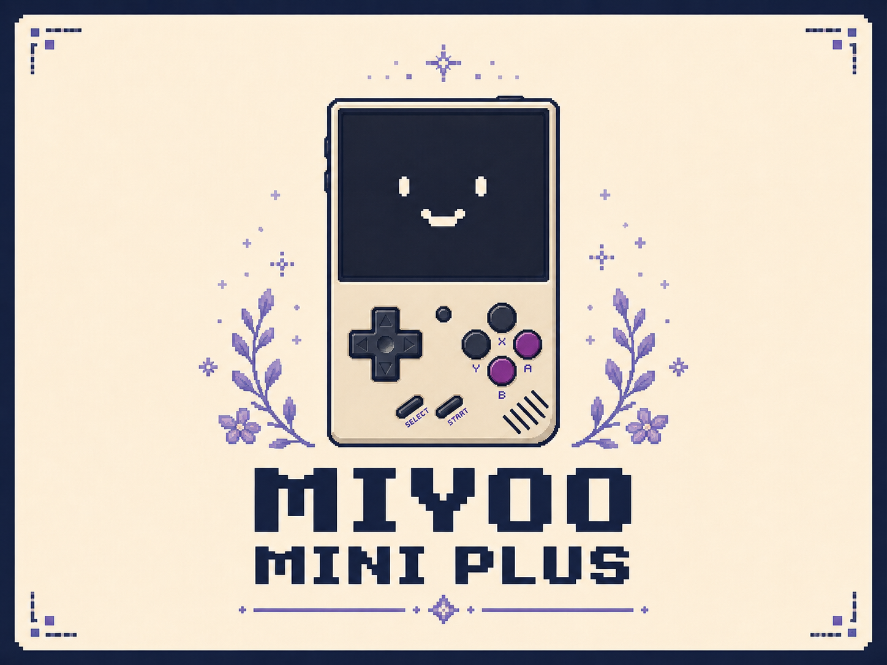
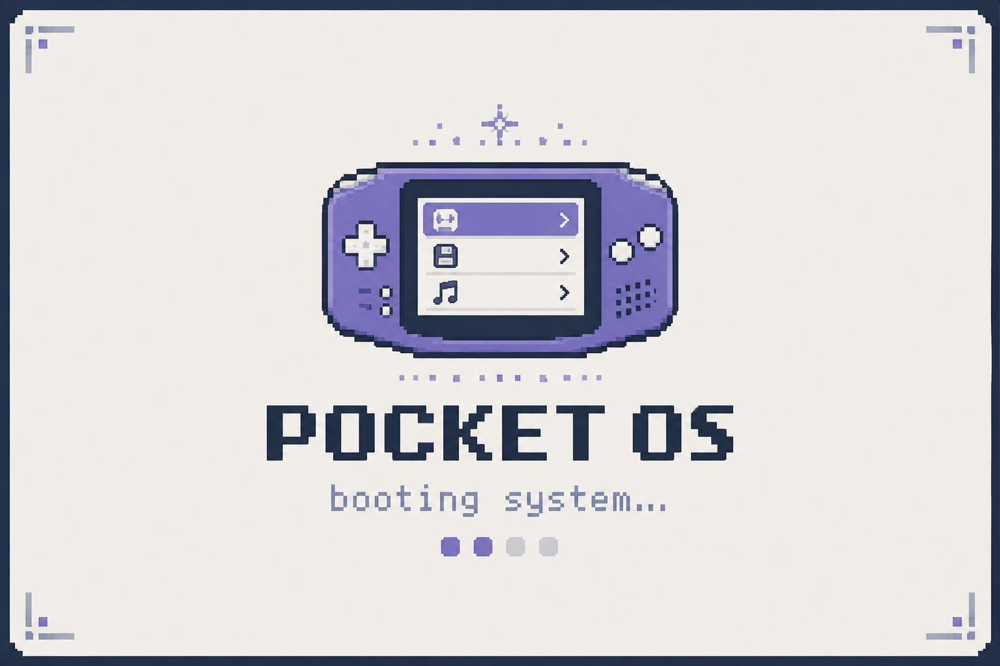
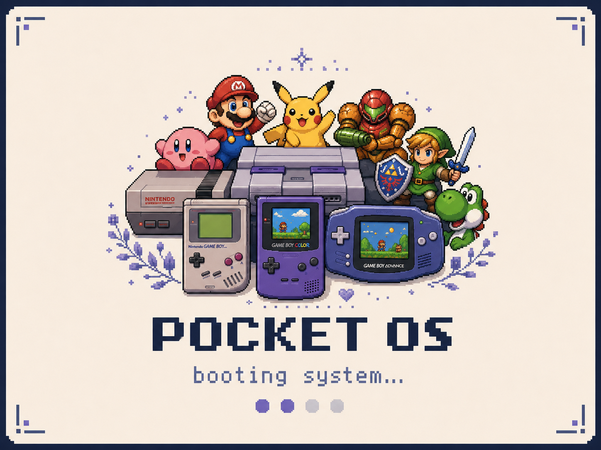

# PocketOS

> **PUBLIC DISTRIBUTION TEMPORARILY PAUSED**
>
> PocketOS currently has **no published GitHub Releases or approved downloadable artifacts**. Previously published releases were removed after review found that the shipped package line lagged safety hardening already present on `main`. Historical Git tags remain for traceability. New public release publishing stays disabled until the [Release Confidence V1 roadmap](docs/roadmap-release-confidence-v1.md) is completed and a fresh candidate is explicitly approved.

A focused game launcher for the [Miyoo Mini Plus](https://lomiyoo.com/), built on top of [Onion OS](https://github.com/OnionUI/Onion). The five-category interface keeps Most Played, Browse, Library, Favorites, and Settings one shoulder press apart while retaining Onion's emulators, apps, and runtime.

The current development tree implements the latest low-overhead design in [the handheld UI notes](docs/handheld-ui-redesign.md): five visible rows, flat high-contrast colors, real library counts, and no thumbnails or GPU-heavy effects.

Requires Onion OS to be installed first.

---

## Distribution status

PocketOS installers, SD-card ZIPs, ROM Importer packages, Genre Scanner packages, and other release artifacts are **not currently approved for distribution**.

The repository source remains available for inspection and development. Historical version tags are retained only for traceability and must not be treated as current release approval.

Distribution may resume only after the current source, safety evidence, device evidence, review provenance, package identity, and release gates are reconciled and a fresh release candidate is verified.

See:

- [Project assessment — 2026-09-16](docs/project-assessment-2026-09-16.md)
- [Release Confidence V1 roadmap](docs/roadmap-release-confidence-v1.md)
- [Historical v1.3 reliability roadmap](docs/roadmap-v1.3-reliability.md)

---

## Screenshots

**Boot Screen**

  

**Splash Screens**

  
  

**Most Played**

  

**Browse**

  

**Library**

  

**Favorites**

  

**Settings**

  

---

## Fonts

Use **Settings → Appearance → Font** to choose a typeface. PocketOS includes compact, high-legibility options for the Miyoo Mini Plus display: DejaVu Sans, Lato, Noto Sans, Roboto Condensed, and Kenney Future Narrow.

---

## Themes

PocketOS includes 53 built-in color schemes. In **Settings → Appearance → Theme**, choose from the original light palettes and purpose-built dark variants including Ayu, Catppuccin Mocha, Dracula, Everforest, Gruvbox, Kanagawa, Monokai, Nord, One Dark, Rosé Pine, Solarized, and Tokyo Night. Changes preview live before you confirm them.

---

## Health monitoring (development/testing)

PocketOS can write a small local health log—memory use, available memory, battery level, brightness, and screen state—to help diagnose long-session issues. It records no game names and sends nothing online. The repository also contains stress-test and launcher-comparison tooling used for development validation.

These tools do not override the current distribution hold. Release-grade device claims require retained evidence under the Release Confidence V1 roadmap.

---

## Credits

Built on [Onion OS](https://github.com/OnionUI/Onion). Icons from the Onion default icon set.
