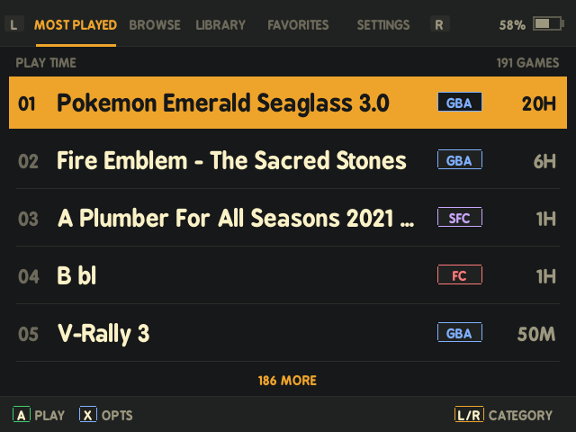
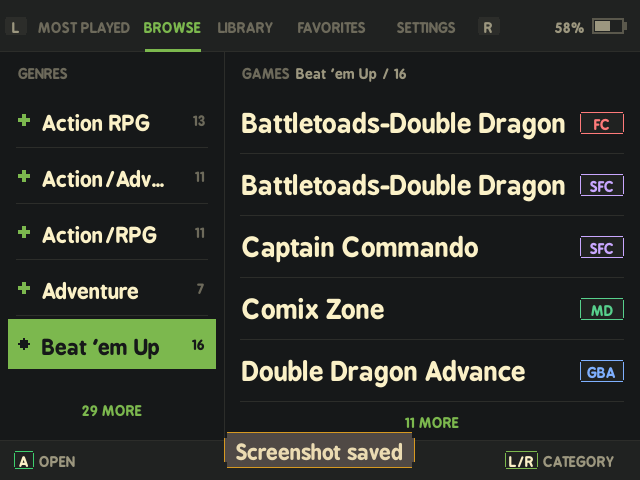
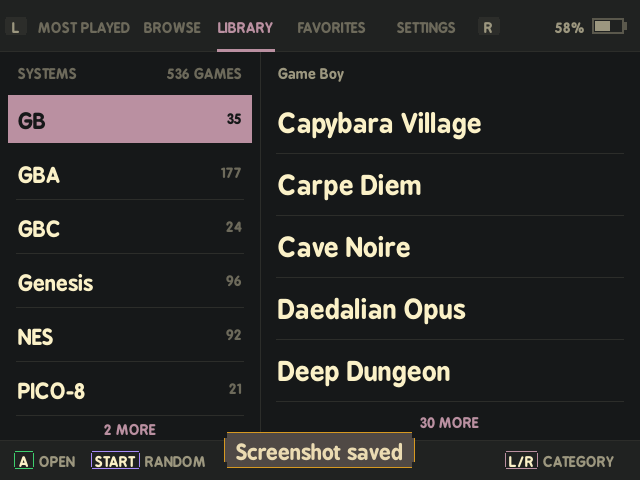
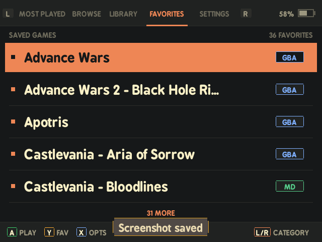
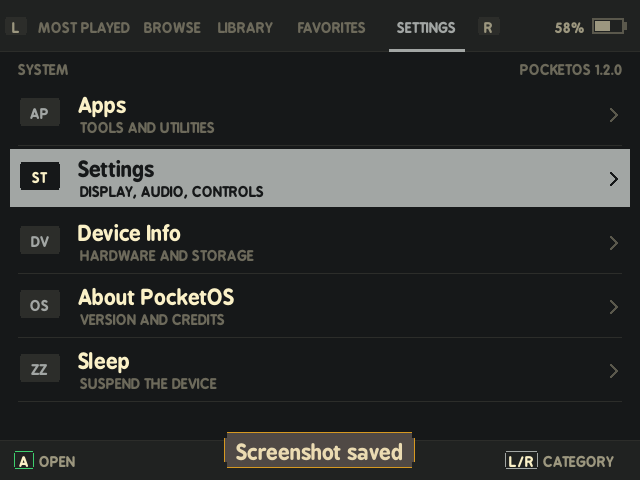

# PocketOS

A focused game launcher for the [Miyoo Mini Plus](https://lomiyoo.com/), built on top of [Onion OS](https://github.com/OnionUI/Onion). The five-category interface keeps Most Played, Browse, Library, Favorites, and Settings one shoulder press apart while retaining Onion's emulators, apps, and runtime.

PocketOS 1.2.0 implements the latest low-overhead design in [the handheld UI notes](docs/handheld-ui-redesign.md): five visible rows, flat high-contrast colors, real library counts, and no thumbnails or GPU-heavy effects.

Requires Onion OS to be installed first. If you haven't set that up yet, grab it [here](https://github.com/OnionUI/Onion/releases/latest). The boot screen flasher is included on your SD card under Apps once Onion is installed.

---

## Screenshots

**Most Played**

  

**Browse**

  

**Library**

  

**Favorites**

  

**Settings**

  

---

## Install

### PocketOS Setup Suite (recommended)

The installer is a terminal setup tool that validates your SD card before it copies anything. It handles everything in one go:

1. **Installs PocketOS** onto your SD card
2. **Imports ROMs** from a folder you choose — unzips them and places each game in the correct system folder automatically
3. **Cleans up bad dumps** — optionally removes inferior variants (bad dumps, overdumps, hacks, pirates) and keeps the best verified dump per game
4. **Scans genres** using the OpenVGDB database so Browse by Genre works out of the box
5. **Applies genre overrides** to fix common mis-tags

Download the installer for your platform:

| Platform | Download |
|----------|---------|
| Linux | `PocketOS-Installer-linux.tar.gz` — extract, then run `./PocketOS-Installer-linux` |
| Windows | `PocketOS-Installer-windows.zip` — extract, then run `PocketOS-Installer-windows.exe` |
| macOS | `PocketOS-Installer-macos.tar.gz` — extract, then run `./PocketOS-Installer-macos` |

Point it at your SD card and choose **Install PocketOS**. The installer checks for Onion's runtime files, installs a fail-open launcher hook, makes the PocketOS binary executable, can import ROM ZIPs, and checks for newer versions automatically.

### Manual install

Download `pocketOS-vX.X.zip` and extract it to the **root of your SD card**. Then open a terminal in the SD card root and run `python3 install-pocketos.py`. This installs a fail-open Onion launcher hook; if PocketOS ever fails, the stock Onion menu is used for the rest of that boot.

### Uninstall

Use the installer's **Uninstall PocketOS** option to remove PocketOS and restore the stock Onion launch block. Deleting `.tmp_update/bin/pocketOS` is also safe: the launcher hook will use Onion's default menu when the PocketOS binary is absent.

---

## Browse by Genre

PocketOS can filter your library by genre. The Setup Suite handles this automatically during install. If you want to re-scan genres separately, use the standalone **Genre Scanner**:

| Platform | Download |
|----------|---------|
| Linux | `PocketOS-GenreScanner-linux.tar.gz` — extract, then run `./PocketOS-GenreScanner-linux` |
| Windows | `PocketOS-GenreScanner-windows.exe` |
| macOS | `PocketOS-GenreScanner-macos.tar.gz` — extract, then run `./PocketOS-GenreScanner-macos` |

Point it at your SD card and it'll scan all your ROM folders and write `miyoogamelist.xml` files for each system.

---

## ROM Import

The Setup Suite includes a standalone **ROM Importer** tool if you want to add games after initial setup:

| Platform | Download |
|----------|---------|
| Linux | `PocketOS-ROMImporter-linux.tar.gz` — extract, then run `./PocketOS-ROMImporter-linux` |
| Windows | `PocketOS-ROMImporter-windows.exe` |
| macOS | `PocketOS-ROMImporter-macos.tar.gz` — extract, then run `./PocketOS-ROMImporter-macos` |

It scans a folder for ZIP files, extracts the ROMs into the correct system folders on your SD card, optionally removes bad/duplicate dumps, and re-scans genres — the same pipeline the installer runs.

---

## Credits

Built on [Onion OS](https://github.com/OnionUI/Onion). Icons from the Onion default icon set.
